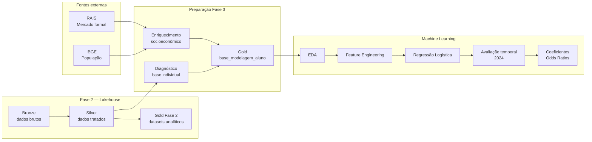

# Predição e Inteligência Analítica para Alfabetização no Brasil

Projeto de **Machine Learning supervisionado** desenvolvido no **Databricks** para prever a probabilidade de um aluno ser classificado como alfabetizado, utilizando variáveis educacionais, territoriais e socioeconômicas.

O projeto foi desenvolvido como entrega do **Tech Challenge — Fase 3**, dando continuidade à pipeline construída na Fase 2 e utilizando a camada Gold/Lakehouse como base para exploração, enriquecimento, modelagem, avaliação temporal e interpretação dos resultados.

---

## Sumário

- [1. Contexto do problema](#1-contexto-do-problema)
- [2. Objetivos](#2-objetivos)
- [3. Fontes de dados](#3-fontes-de-dados)
- [4. Arquitetura da solução](#4-arquitetura-da-solução)
- [5. Fluxo analítico](#5-fluxo-analítico)
- [6. Base individual de modelagem](#6-base-individual-de-modelagem)
- [7. Enriquecimento socioeconômico](#7-enriquecimento-socioeconômico)
- [8. Diagnóstico e prevenção de data leakage](#8-diagnóstico-e-prevenção-de-data-leakage)
- [9. Análise Exploratória de Dados](#9-análise-exploratória-de-dados)
- [10. Modelagem supervisionada](#10-modelagem-supervisionada)
- [11. Avaliação e interpretabilidade](#11-avaliação-e-interpretabilidade)
- [12. Resultados finais](#12-resultados-finais)
- [13. Tecnologias utilizadas](#13-tecnologias-utilizadas)
- [14. Decisões metodológicas e trade-offs](#14-decisões-metodológicas-e-trade-offs)
- [15. Estrutura do repositório](#15-estrutura-do-repositório)
- [16. Como executar](#16-como-executar)
- [17. Resultados da execução](#17-resultados-da-execução) (a execução com evidências de cada notebook está aqui!)
- [18. Estratégia de Git](#18-estratégia-de-git)
- [19. Limitações e evoluções futuras](#19-limitações-e-evoluções-futuras)
- [20. Referências](#20-referências)

---

## 1. Contexto do problema

A alfabetização nos primeiros anos escolares é um dos principais determinantes da trajetória educacional de uma criança.

A Fase 2 deste Tech Challenge construiu uma pipeline Lakehouse para ingestão, tratamento, qualidade, monitoramento e disponibilização de dados de alfabetização nas camadas Bronze, Silver e Gold.

Na Fase 3, o foco passa de **engenharia e disponibilização de dados** para **predição e inteligência analítica**.

O desafio central é responder:

> **É possível estimar, a partir do contexto educacional, territorial e socioeconômico disponível, a probabilidade de um aluno ser classificado como alfabetizado?**

A solução foi desenvolvida com uma preocupação adicional: evitar modelos excessivamente complexos.

O objetivo não é apenas obter uma métrica, mas construir um modelo:

- simples;
- reproduzível;
- explicável;
- temporalmente consistente;
- sem data leakage;
- adequado ao uso analítico e territorial.

---

## 2. Objetivos

### Objetivo geral

Construir um modelo supervisionado capaz de estimar a classificação de alfabetização de alunos, integrando dados educacionais e socioeconômicos em uma pipeline de Machine Learning executada no Databricks.

### Objetivos específicos

- diagnosticar a base individual de alunos;
- identificar inconsistências e riscos de leakage;
- enriquecer os dados educacionais com informações socioeconômicas;
- criar uma Gold individual para modelagem;
- realizar Análise Exploratória de Dados;
- selecionar um conjunto enxuto de features;
- construir uma pipeline de preprocessing integrada;
- treinar um modelo supervisionado explicável;
- validar o modelo temporalmente;
- comparar o resultado com um baseline simples;
- interpretar coeficientes e odds ratios;
- avaliar diferenças de desempenho territorial;
- documentar limitações e possibilidades de uso.

---

## 3. Fontes de dados

O projeto reutiliza os dados educacionais preparados na Fase 2 e adiciona fontes externas para enriquecimento socioeconômico.

### 3.1 Dados educacionais

Fonte principal:

**Avaliação da Alfabetização — Inep / Base dos Dados**

A tabela individual utilizada como origem da modelagem é:

```text
workspace.alfabetizacao_silver.fato_alunos
```

Principais campos disponíveis:

| Campo | Descrição |
|---|---|
| `ano` | Ano da avaliação |
| `id_aluno` | Identificador técnico do aluno |
| `id_escola` | Identificador da escola |
| `id_municipio` | Código IBGE do município |
| `sigla_uf` | Unidade federativa |
| `rede` | Rede de ensino |
| `presenca` | Indicador de presença |
| `alfabetizado` | Classificação do aluno |
| `proficiencia` | Proficiência observada |
| `peso_aluno` | Peso amostral |

### 3.2 População municipal

Fonte:

**IBGE / Base dos Dados**

Arquivo:

```text
br_ibge_populacao_municipio.csv.gz
```

Campos utilizados:

```text
ano
sigla_uf
id_municipio
populacao
```

### 3.3 RAIS

Fonte:

**Relação Anual de Informações Sociais — RAIS / Base dos Dados**

A consulta foi agregada por município e ano, utilizando:

```text
quantidade_vinculos_ativos
quantidade_vinculos_clt
quantidade_vinculos_estatutarios
```

Para evitar risco de vazamento temporal, a RAIS foi utilizada com defasagem de um ano:

```text
RAIS 2022 → contexto dos alunos de 2023
RAIS 2023 → contexto dos alunos de 2024
```

O resultado foi armazenado como:

```text
rais_municipio_2022_2023.csv
```

### 3.4 Armazenamento das fontes externas

Os arquivos não são versionados no GitHub.

Eles são armazenados em:

```text
/Volumes/workspace/alfabetizacao_bronze/socioeconomico/
```

Estrutura:

```text
socioeconomico/
├── br_ibge_populacao_municipio.csv.gz
└── rais_municipio_2022_2023.csv
```

---

## 4. Arquitetura da solução

A Fase 3 aproveita a arquitetura Lakehouse construída anteriormente e adiciona uma camada de enriquecimento e Machine Learning.



---

## 5. Fluxo analítico

1. A tabela `fato_alunos` da Fase 2 é utilizada como fonte individual.
2. É realizado um diagnóstico de volume, cobertura, target, duplicidades e temporalidade.
3. A variável `proficiencia` é identificada como leakage e removida das features.
4. O comportamento do `id_aluno` entre anos é investigado.
5. População e RAIS são carregadas de fontes externas.
6. A RAIS é defasada em um ano.
7. As fontes socioeconômicas são integradas por município.
8. É criada a tabela Silver `socioeconomico_municipio`.
9. Os dados individuais e socioeconômicos são combinados.
10. É criada a Gold `base_modelagem_aluno`.
11. O ano de 2023 é reservado para desenvolvimento.
12. O ano de 2024 é reservado para teste temporal.
13. A EDA avalia target, redes, UFs, municípios e variáveis socioeconômicas.
14. Features redundantes e de alta cardinalidade são removidas.
15. Uma Regressão Logística é treinada.
16. O modelo é comparado com um baseline majoritário.
17. Coeficientes e odds ratios são analisados.
18. Métricas e coeficientes são persistidos na camada Gold.

---

## 6. Base individual de modelagem

A Fase 2 possuía uma base Gold agregada por município.

Para o objetivo da Fase 3, foi necessária uma nova tabela no nível individual.

Tabela criada:

```text
workspace.alfabetizacao_gold.base_modelagem_aluno
```

Granularidade:

> **1 linha = 1 aluno em determinado ano**

### Volume final

| Ano | Grupo | Registros | Municípios | UFs | % alfabetizados |
|---|---|---:|---:|---:|---:|
| 2023 | `DESENVOLVIMENTO_2023` | 1.747.439 | 4.873 | 23 | 50,21% |
| 2024 | `TESTE_TEMPORAL_2024` | 2.120.560 | 5.519 | 26 | 52,21% |

Total:

```text
3.867.999 registros
```

### Unicidade

A combinação:

```text
id_aluno + ano
```

apresentou:

```text
0 duplicidades
```

---

## 7. Enriquecimento socioeconômico

A tabela criada para o contexto municipal foi:

```text
workspace.alfabetizacao_silver.socioeconomico_municipio
```

### Features geradas

```text
populacao
quantidade_vinculos_ativos
quantidade_vinculos_clt
quantidade_vinculos_estatutarios
vinculos_ativos_por_1000_habitantes
```

A feature:

```text
vinculos_ativos_por_1000_habitantes
```

é calculada como:

```text
quantidade_vinculos_ativos / populacao * 1000
```

Ela normaliza o tamanho do mercado formal pelo porte populacional do município.

### Cobertura sobre a base de alunos

| Ano | Municípios dos alunos | Com população | Com RAIS |
|---|---:|---:|---:|
| 2023 | 4.873 | 4.873 | 4.873 |
| 2024 | 5.519 | 5.519 | 5.519 |

Resultado:

> **100% de cobertura socioeconômica sobre os municípios presentes na base de alunos.**

---

## 8. Diagnóstico e prevenção de data leakage

Um dos principais objetivos metodológicos foi evitar que o modelo aprendesse informações indisponíveis no momento da previsão.

### 8.1 Proficiência

A análise mostrou forte separação entre as classes:

```text
Não alfabetizados
média de proficiência ≈ 702,82

Alfabetizados
média de proficiência ≈ 779,84
```

O ponto de separação ocorre próximo do próprio critério utilizado para classificar alfabetização.

Portanto:

```text
proficiencia → removida
```

A utilização dessa variável faria o modelo reconstruir diretamente o target.

### 8.2 Identificador do aluno

Inicialmente foi investigada a possibilidade de usar `id_aluno` como identificador longitudinal entre 2023 e 2024.

Foram encontrados:

```text
1.515.671 IDs presentes nos dois anos
```

Entre esses IDs:

```text
1.274.442 → município diferente
1.513.829 → escola diferente
0 → UF diferente
```

Percentualmente:

```text
≈ 84,08% com município diferente
≈ 99,88% com escola diferente
```

Esse comportamento não sustenta o uso de `id_aluno` como chave longitudinal confiável.

Decisão:

> `id_aluno` é tratado apenas como identificador técnico dentro de cada edição.

### 8.3 Separação temporal

A estratégia final foi:

```text
2023
↓
desenvolvimento + validação + treinamento

2024
↓
teste temporal final
```

Isso evita depender de uma interpretação longitudinal do identificador e cria um teste *out-of-time*.

### 8.4 RAIS defasada

Para evitar uso de informação futura:

```text
alunos 2023 ← RAIS 2022
alunos 2024 ← RAIS 2023
```

---

## 9. Análise Exploratória de Dados

### 9.1 Distribuição do target

| Ano | Não alfabetizados | Alfabetizados | % alfabetizados |
|---|---:|---:|---:|
| 2023 | 870.012 | 877.427 | 50,21% |
| 2024 | 1.013.441 | 1.107.119 | 52,21% |

O target é aproximadamente balanceado.

Consequência:

> Não foi necessária a aplicação de SMOTE, oversampling ou undersampling.

### 9.2 Rede de ensino

| Ano | Rede | Alunos | Taxa de alfabetização |
|---|---|---:|---:|
| 2023 | 3 | 1.592.299 | 50,04% |
| 2023 | 2 | 155.140 | 51,99% |
| 2024 | 3 | 1.840.277 | 51,97% |
| 2024 | 2 | 280.258 | 53,79% |

A variável apresenta sinal pequeno, porém relativamente estável.

### 9.3 Diferenças territoriais

As taxas apresentam grande heterogeneidade entre UFs.

Exemplos de 2024:

| UF | Taxa de alfabetização |
|---|---:|
| CE | 83,73% |
| GO | 67,00% |
| ES | 64,83% |
| MG | 64,50% |
| PR | 61,06% |
| BA | 32,38% |
| RN | 31,06% |

A análise indica que o componente territorial é um dos sinais mais fortes disponíveis.

### 9.4 População

A população apresenta forte assimetria.

Em 2023:

```text
mediana ≈ 85.597
média   ≈ 507.234
máximo  ≈ 6,2 milhões
```

Por esse motivo foi criada:

```text
log_populacao = log1p(populacao)
```

### 9.5 Mercado formal

A feature:

```text
vinculos_ativos_por_1000_habitantes
```

apresentou sinal analítico superior ao uso isolado dos volumes absolutos.

### 9.6 Multicolinearidade

As variáveis absolutas de população e vínculos apresentaram correlação extremamente alta:

| Variáveis | Correlação |
|---|---:|
| vínculos ativos × vínculos CLT | 0,998 |
| população × vínculos ativos | 0,994 |
| população × vínculos CLT | 0,990 |
| população × vínculos estatutários | 0,886 |

Por isso, os volumes absolutos foram substituídos por features mais interpretáveis.

---

## 10. Modelagem supervisionada

### 10.1 Modelo escolhido

O modelo final é:

> **Regressão Logística**

Motivos:

- simples;
- explicável;
- adequada a classificação binária;
- eficiente em milhões de registros;
- permite interpretação por coeficientes;
- permite cálculo de odds ratios;
- fácil de reproduzir e apresentar.

### 10.2 Features finais

O modelo utiliza apenas cinco features.

#### Categóricas

```text
rede
sigla_uf
```

#### Numéricas

```text
log_populacao
vinculos_ativos_por_1000_habitantes
proporcao_vinculos_estatutarios
```

### 10.3 Features excluídas

| Feature | Motivo |
|---|---|
| `id_aluno` | Identificador técnico |
| `id_municipio` | Alta cardinalidade e risco de memorização territorial |
| `nome_municipio` | Redundante com o identificador territorial |
| `id_escola` | Alta cardinalidade |
| `proficiencia` | Data leakage direto |
| `serie` | Variância zero |
| `peso_aluno` | Peso amostral |
| `caderno` | Variável operacional |
| `preenchimento_caderno` | Variável operacional |
| `presenca` | Informação associada ao momento da avaliação |
| `ano` | Constante dentro do conjunto de treinamento |
| `ano_rais` | Metadado temporal |

### 10.4 Preprocessing

A Pipeline do Spark ML utiliza:

```text
StringIndexer
↓
OneHotEncoder
↓
VectorAssembler
↓
StandardScaler
↓
LogisticRegression
```

O tratamento de categorias utiliza:

```text
handleInvalid = "keep"
```

permitindo inferência em categorias não vistas no treinamento.

### 10.5 Seleção do hiperparâmetro

Como o `CrossValidator` do Spark ML utiliza caching interno incompatível com as restrições observadas no ambiente Serverless, foi utilizada uma validação explícita.

Amostra estratificada:

```text
401.063 registros de 2023
```

Divisão:

```text
Treino:    320.673 registros
Validação:  80.390 registros
```

Valores testados:

```text
regParam = 0.0
regParam = 0.01
regParam = 0.1
```

Resultados:

| regParam | ROC-AUC validação |
|---:|---:|
| 0,00 | **0,636982** |
| 0,01 | 0,631282 |
| 0,10 | 0,607584 |

Selecionado:

```text
regParam = 0.0
```

O modelo final foi então treinado com todos os:

```text
1.747.439 registros de 2023
```

---

## 11. Avaliação e interpretabilidade

### 11.1 Teste temporal

O teste final utiliza exclusivamente:

```text
2024
2.120.560 registros
```

### 11.2 Métricas finais

O modelo enxuto obteve os seguintes resultados no teste temporal de 2024:

| Métrica | Valor |
|---|---:|
| Accuracy | **58,5535%** |
| Precision | **60,8746%** |
| Recall | **57,6973%** |
| Specificity | **59,4888%** |
| F1 | **59,2434%** |
| Balanced Accuracy | **58,5931%** |
| Macro-F1 | **58,5416%** |
| ROC-AUC | **0,621262** |

Matriz de confusão do teste temporal:

| Resultado | Registros |
|---|---:|
| Verdadeiro Positivo (TP) | 638.778 |
| Verdadeiro Negativo (TN) | 602.884 |
| Falso Positivo (FP) | 410.557 |
| Falso Negativo (FN) | 468.341 |

### 11.3 Baseline

Baseline:

> prever sempre a classe majoritária observada em 2023.

Accuracy do baseline:

```text
52,2088%
```

Accuracy do modelo:

```text
58,5535%
```

Ganho absoluto:

```text
+6,3447 pontos percentuais
```

### 11.4 Interpretação

A capacidade discriminatória do modelo é **moderada**, mas real.

A estabilidade entre validação e teste temporal também é relevante:

```text
ROC-AUC validação 2023 = 0,636982
ROC-AUC teste 2024     = 0,621262
```

A queda é pequena o suficiente para indicar alguma estabilidade temporal.

### 11.5 Principais sinais

O modelo mostra forte influência territorial.

Na análise anterior, UFs como Ceará, Paraná, Rondônia, Espírito Santo e Goiás apresentaram associação positiva, enquanto Rio Grande do Norte, Sergipe, Bahia e Tocantins apresentaram associação negativa em relação às categorias de referência do One-Hot Encoding.

Entre as variáveis numéricas:

```text
log_populacao
```

apresenta associação negativa.

```text
vinculos_ativos_por_1000_habitantes
```

apresenta associação positiva.

### 11.6 Odds ratios

Na Regressão Logística:

```text
odds_ratio = exp(coeficiente)
```

Interpretação:

```text
OR > 1 → associação positiva
OR < 1 → associação negativa
OR ≈ 1 → efeito pequeno
```

As features numéricas são padronizadas.

Portanto, os odds ratios das variáveis numéricas representam aproximadamente a alteração nas odds associada a uma variação de **1 desvio-padrão na feature transformada**.

A interpretação é associativa, e não causal.

---

## 12. Resultados finais

### Resumo do projeto

```text
Registros totais
3.867.999

Treinamento
2023 — 1.747.439 alunos

Teste temporal
2024 — 2.120.560 alunos

Features finais
5

Modelo
Regressão Logística

ROC-AUC
0,621262

Accuracy
58,5535%

Baseline
52,2088%
```

### Interpretação executiva

O modelo supera o baseline e identifica sinais territoriais e socioeconômicos associados à alfabetização.

Entretanto, as features disponíveis são predominantemente contextuais.

Isso significa que o modelo tem maior capacidade de distinguir:

> **contextos territoriais associados a maior ou menor risco de não alfabetização**

do que distinguir:

> **dois alunos individuais dentro do mesmo contexto territorial.**

Por esse motivo, o uso recomendado é analítico e territorial.

### Aplicações possíveis

- priorização de territórios para investigação;
- identificação de contextos de maior vulnerabilidade;
- comparação entre UFs;
- geração de hipóteses para políticas públicas;
- acompanhamento de padrões territoriais;
- apoio à alocação de esforços analíticos.

### Uso não recomendado

O modelo não deve ser utilizado isoladamente para:

- decisões individuais sobre alunos;
- classificação de risco de alto impacto;
- decisões causais;
- punição de escolas, redes ou municípios;
- alocação automática de recursos sem análise humana.

---

## 13. Tecnologias utilizadas

| Tecnologia | Uso no projeto |
|---|---|
| Databricks | Ambiente de desenvolvimento e execução |
| Apache Spark | Processamento distribuído |
| PySpark | Transformações e análises |
| Spark SQL | Consultas e validações |
| Spark ML | Pipeline e Regressão Logística |
| Delta Lake | Persistência das tabelas |
| Unity Catalog | Organização dos schemas, tabelas e Volumes |
| Databricks Volumes | Armazenamento dos arquivos externos |
| Pandas | Apoio à interpretação de coeficientes |
| Matplotlib | Visualizações da EDA |
| Git | Versionamento |
| GitHub | Repositório e Pull Requests |
| Mermaid | Diagramas versionados como código |

---

## 14. Decisões metodológicas e trade-offs

### 14.1 Regressão Logística versus modelos complexos

A prioridade foi interpretabilidade.

Modelos mais complexos poderiam capturar não linearidades adicionais, mas aumentariam:

- custo computacional;
- complexidade de explicação;
- risco de overfitting;
- dificuldade de auditoria.

A Regressão Logística fornece uma baseline supervisionada forte e transparente.

### 14.2 Teste temporal versus split aleatório

Um split aleatório misturaria alunos de diferentes anos.

A abordagem adotada foi:

```text
2023 → treinamento
2024 → teste
```

Isso fornece uma avaliação mais próxima do uso real:

> treinar com dados históricos e prever uma edição posterior.

### 14.3 Município como feature

O município possui milhares de categorias.

Utilizá-lo diretamente poderia permitir que o modelo memorizasse territórios.

Por isso:

```text
id_municipio → excluído do modelo
```

mas mantido na Gold para análise e rastreabilidade.

### 14.4 UF versus região

A região é completamente derivada da UF.

Apesar de apresentar pequeno ganho em testes exploratórios, a solução final removeu `regiao` para priorizar:

- menor redundância;
- maior parcimônia;
- interpretação mais limpa;
- menor quantidade de features.

### 14.5 Volumes absolutos da RAIS

População, vínculos ativos e vínculos CLT apresentaram correlação próxima de 1.

A solução substituiu parte dos volumes por indicadores relativos:

```text
vinculos_ativos_por_1000_habitantes
proporcao_vinculos_estatutarios
```

### 14.6 Cross-Validation e Serverless

O `CrossValidator` do Spark ML utiliza cache interno.

No ambiente Serverless utilizado no projeto, esse comportamento apresentou limitações de persistência.

Foi adotada uma alternativa simples:

```text
amostra estratificada
↓
80% treino
20% validação
↓
seleção de regParam
```

Essa escolha mantém reprodutibilidade e separação entre treino, validação e teste.

---

## 15. Estrutura do repositório

```text
tech-challenge-fase3/
├── notebooks/
│   ├── 00_diagnostico_base_modelagem.ipynb
│   ├── 01_enriquecimento_socioeconomico.ipynb
│   ├── 02_construcao_gold_modelagem.ipynb
│   ├── 03_eda.ipynb
│   ├── 04_modelagem_supervisionada.ipynb
│   └── 05_avaliacao_interpretabilidade.ipynb
├── data/
├── reports/
├── images/
├── src/
│   ├── preprocessing/
│   ├── modeling/
│   ├── evaluation/
│   └── visualization/
├── requirements.txt
├── .gitignore
└── README.md
```

### Responsabilidade dos notebooks

| Notebook | Responsabilidade |
|---|---|
| `00_diagnostico_base_modelagem` | Diagnóstico do target, granularidade, leakage e separação temporal |
| `01_enriquecimento_socioeconomico` | Integra população e RAIS |
| `02_construcao_gold_modelagem` | Constrói a Gold individual |
| `03_eda` | Explora distribuições, territórios e features |
| `04_modelagem_supervisionada` | Seleciona regularização e treina a Regressão Logística |
| `05_avaliacao_interpretabilidade` | Avalia o modelo final e interpreta coeficientes |

---

## 16. Como executar

### Pré-requisitos

- workspace Databricks;
- computação Serverless;
- repositório clonado como Git Folder;
- pipeline da Fase 2 previamente executada;
- tabela `workspace.alfabetizacao_silver.fato_alunos`;
- arquivos socioeconômicos disponíveis no Volume.

### Arquivos externos

```text
/Volumes/workspace/alfabetizacao_bronze/socioeconomico/
├── br_ibge_populacao_municipio.csv.gz
└── rais_municipio_2022_2023.csv
```

### Ordem de execução

```text
00_diagnostico_base_modelagem
01_enriquecimento_socioeconomico
02_construcao_gold_modelagem
03_eda
04_modelagem_supervisionada
05_avaliacao_interpretabilidade
```

### Principais tabelas produzidas

```text
workspace.alfabetizacao_silver.socioeconomico_municipio

workspace.alfabetizacao_gold.base_modelagem_aluno

workspace.alfabetizacao_gold.metricas_modelo_fase3

workspace.alfabetizacao_gold.avaliacao_modelo_fase3

workspace.alfabetizacao_gold.coeficientes_modelo_fase3
```

---

## 17. Resultados da execução

> [!IMPORTANT]
> Todos os notebooks da Fase 3 foram executados individualmente no Databricks.  
> Esta seção registra a finalidade, as principais evidências e o vídeo de execução de cada etapa.

> Os links abaixo devem ser substituídos pelos vídeos enviados ao GitHub em `user-attachments`.

---

### 17.1 Notebook 00 — Diagnóstico da base de modelagem

O notebook `00_diagnostico_base_modelagem.ipynb` valida a base individual que será utilizada no projeto.

A etapa verifica:

- volume total;
- distribuição anual;
- balanceamento do target;
- cobertura territorial;
- duplicidade de `id_aluno + ano`;
- recorrência do identificador entre anos;
- risco de data leakage;
- adequação da estratégia temporal.

Principais resultados:

```text
3.867.999 registros

2023
1.747.439 registros
50,21% alfabetizados

2024
2.120.560 registros
52,21% alfabetizados

Duplicidades id_aluno + ano
0
```

A análise também demonstrou que `id_aluno` não deve ser tratado como identificador longitudinal persistente.

**Vídeo de evidência:**

https://github.com/user-attachments/assets/f0c42506-6ad3-49e7-ba20-8cdacfd5e480

---

### 17.2 Notebook 01 — Enriquecimento socioeconômico

O notebook `01_enriquecimento_socioeconomico.ipynb` integra população municipal e RAIS.

A RAIS é utilizada com defasagem de um ano.

Principais evidências:

- leitura de CSV e CSV.GZ;
- padronização das chaves municipais;
- integração população + RAIS;
- criação de `vinculos_ativos_por_1000_habitantes`;
- validação de duplicidades;
- validação de cobertura.

Cobertura:

```text
2023
4.873 municípios dos alunos
4.873 com população
4.873 com RAIS

2024
5.519 municípios dos alunos
5.519 com população
5.519 com RAIS
```

Resultado:

```text
100% de cobertura
```

Tabela criada:

```text
workspace.alfabetizacao_silver.socioeconomico_municipio
```

**Vídeo de evidência:**

https://github.com/user-attachments/assets/cd2684d4-ec69-4190-86d1-a9e6122d432d

---

### 17.3 Notebook 02 — Construção da Gold individual

O notebook `02_construcao_gold_modelagem.ipynb` combina a base individual com o contexto socioeconômico.

Principais evidências:

- granularidade individual preservada;
- 0 duplicidades;
- target convertido para `0/1`;
- exclusão de variáveis com leakage;
- separação metodológica por ano;
- persistência em Delta Lake.

Grupos finais:

```text
2023
DESENVOLVIMENTO_2023
1.747.439 registros

2024
TESTE_TEMPORAL_2024
2.120.560 registros
```

Tabela criada:

```text
workspace.alfabetizacao_gold.base_modelagem_aluno
```

**Vídeo de evidência:**

https://github.com/user-attachments/assets/8f15ae53-b1c3-4e04-9fb9-0566b9d3698f

---

### 17.4 Notebook 03 — Análise Exploratória de Dados

O notebook `03_eda.ipynb` analisa o comportamento do target e das variáveis explicativas.

Principais evidências:

- target aproximadamente balanceado;
- diferenças importantes entre UFs;
- sinal pequeno, porém estável, por rede;
- forte assimetria de população;
- análise por decis de população;
- análise por decis de vínculos formais;
- correlação das variáveis numéricas com o target;
- identificação de multicolinearidade;
- avaliação de cardinalidade.

Correlação identificada entre algumas variáveis:

```text
vínculos ativos × vínculos CLT
≈ 0,998

população × vínculos ativos
≈ 0,994

população × vínculos CLT
≈ 0,990
```

Esse diagnóstico orientou a seleção de um conjunto reduzido de features.

**Vídeo de evidência:**

https://github.com/user-attachments/assets/2491dc58-d8d5-42f9-9a8b-e03ecf7ac7ff

---

### 17.5 Notebook 04 — Modelagem supervisionada

O notebook `04_modelagem_supervisionada.ipynb` realiza a seleção de regularização e treinamento da Regressão Logística.

Estratégia de tuning:

```text
Amostra estratificada de 2023
401.063 registros

Treino
320.673 registros

Validação
80.390 registros
```

Valores avaliados:

| regParam | ROC-AUC validação |
|---:|---:|
| 0,00 | **0,636982** |
| 0,01 | 0,631282 |
| 0,10 | 0,607584 |

Modelo selecionado:

```text
Regressão Logística
regParam = 0.0
```

Depois da seleção, o modelo é treinado novamente utilizando todos os dados de 2023.

**Vídeo de evidência:**

https://github.com/user-attachments/assets/c7267068-17eb-4682-9432-38c23d8e5dab


---

### 17.6 Notebook 05 — Avaliação e interpretabilidade

O notebook `05_avaliacao_interpretabilidade.ipynb` treina e avalia a especificação final enxuta.

Features:

```text
rede
sigla_uf
log_populacao
vinculos_ativos_por_1000_habitantes
proporcao_vinculos_estatutarios
```

Principais evidências:

- teste temporal em 2024;
- matriz de confusão;
- métricas globais;
- comparação com baseline;
- métricas por UF;
- análise de FP e FN;
- coeficientes;
- odds ratios;
- persistência dos resultados.

Resultados definitivos:

```text
Accuracy
58,5535%

Precision
60,8746%

Recall
57,6973%

Specificity
59,4888%

F1
59,2434%

Balanced Accuracy
58,5931%

Macro-F1
58,5416%

ROC-AUC
0,621262

Baseline Accuracy
52,2088%
```

Tabelas produzidas:

```text
workspace.alfabetizacao_gold.avaliacao_modelo_fase3
workspace.alfabetizacao_gold.coeficientes_modelo_fase3
```

**Vídeo de evidência:**

https://github.com/user-attachments/assets/6730724c-9816-4980-acf3-4f8a3232b080

---

### 17.7 Resumo quantitativo da execução

#### Base individual

| Métrica | Resultado |
|---|---:|
| Registros totais | 3.867.999 |
| Registros treino 2023 | 1.747.439 |
| Registros teste 2024 | 2.120.560 |
| Municípios em 2023 | 4.873 |
| Municípios em 2024 | 5.519 |
| UFs em 2023 | 23 |
| UFs em 2024 | 26 |

#### Modelo

| Métrica | Resultado |
|---|---:|
| Features finais | 5 |
| Modelo | Regressão Logística |
| regParam | 0.0 |
| ROC-AUC validação | 0,636982 |
| ROC-AUC teste | 0,621262 |
| Accuracy | 58,5535% |
| Precision | 60,8746% |
| Recall | 57,6973% |
| Specificity | 59,4888% |
| F1 | 59,2434% |
| Balanced Accuracy | 58,5931% |
| Macro-F1 | 58,5416% |
| Baseline Accuracy | 52,2088% |
| Ganho de Accuracy vs. baseline | +6,3447 p.p. |

---

## 18. Estratégia de Git

O desenvolvimento foi realizado em branches por etapa.

Exemplos:

```text
feature/data-diagnosis
feature/socioeconomic-enrichment
feature/modeling-dataset
feature/eda
feature/supervised-modeling
feature/model-evaluation
```

Práticas adotadas:

- branches de funcionalidade;
- commits pequenos e descritivos;
- Pull Requests;
- integração com Databricks Git Folders;
- correções versionadas separadamente;
- notebooks executados no Databricks;
- dados brutos fora do GitHub.

Exemplos de commits:

```text
feat: add modeling dataset diagnosis notebook
docs: update modeling diagnosis conclusions
feat: add socioeconomic enrichment pipeline
feat: build student modeling gold dataset
fix: use full 2024 temporal test set
feat: add exploratory data analysis
feat: add explainable logistic regression model
feat: add model evaluation and interpretability
```

---

## 19. Limitações e evoluções futuras

### Limitações atuais

- quantidade limitada de variáveis individuais sem leakage;
- features predominantemente territoriais;
- modelo com capacidade discriminatória moderada;
- ausência de informações familiares e socioeconômicas no nível do aluno;
- diferenças de cobertura territorial entre 2023 e 2024;
- algumas UFs não estão presentes no conjunto de treinamento;
- execução acadêmica sem serving online;
- ausência de monitoramento produtivo de drift;
- ausência de MLflow na versão atual;
- modelo não causal.

### Evoluções futuras

- integração com Censo Escolar;
- inclusão de indicadores socioeconômicos adicionais;
- indicadores de infraestrutura escolar;
- dados de docentes e formação;
- variáveis de contexto familiar, quando legalmente e eticamente disponíveis;
- validação temporal com séries históricas maiores;
- comparação com árvores e Gradient Boosting;
- SHAP para modelos não lineares;
- MLflow para rastreamento de experimentos;
- registro e versionamento do modelo;
- Databricks Model Serving;
- monitoramento de drift;
- explicabilidade por grupo territorial;
- análise de fairness;
- avaliação de calibração das probabilidades.

---

## 20. Referências

- BASE DOS DADOS. **Avaliação da Alfabetização**. Disponível em: <https://basedosdados.org/dataset/073a39d4-89cf-4068-b1e8-34ed0d9c0b72>.
- BASE DOS DADOS. **População — IBGE**. Disponível em: <https://basedosdados.org/>.
- BASE DOS DADOS. **RAIS — Relação Anual de Informações Sociais**. Disponível em: <https://basedosdados.org/>.
- BRASIL. Instituto Nacional de Estudos e Pesquisas Educacionais Anísio Teixeira. **Avaliação da Alfabetização**. Disponível em: <https://www.gov.br/inep/>.
- DATABRICKS. **Apache Spark MLlib**. Disponível em: <https://spark.apache.org/docs/latest/ml-guide.html>.
- DATABRICKS. **Machine Learning on Databricks**. Disponível em: <https://docs.databricks.com/>.
- APACHE SPARK. **LogisticRegression**. Disponível em: <https://spark.apache.org/docs/latest/ml-classification-regression.html#logistic-regression>.

---

## Autoria

Projeto desenvolvido para o **Tech Challenge — Fase 3**, com foco em Machine Learning supervisionado, explicabilidade, validação temporal e inteligência analítica aplicada à alfabetização no Brasil.

O projeto dá continuidade à arquitetura Lakehouse desenvolvida na Fase 2 e demonstra a evolução de uma pipeline de engenharia de dados para uma solução completa de análise e modelagem.
